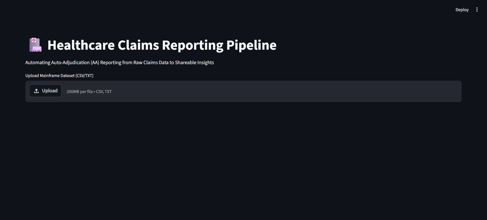
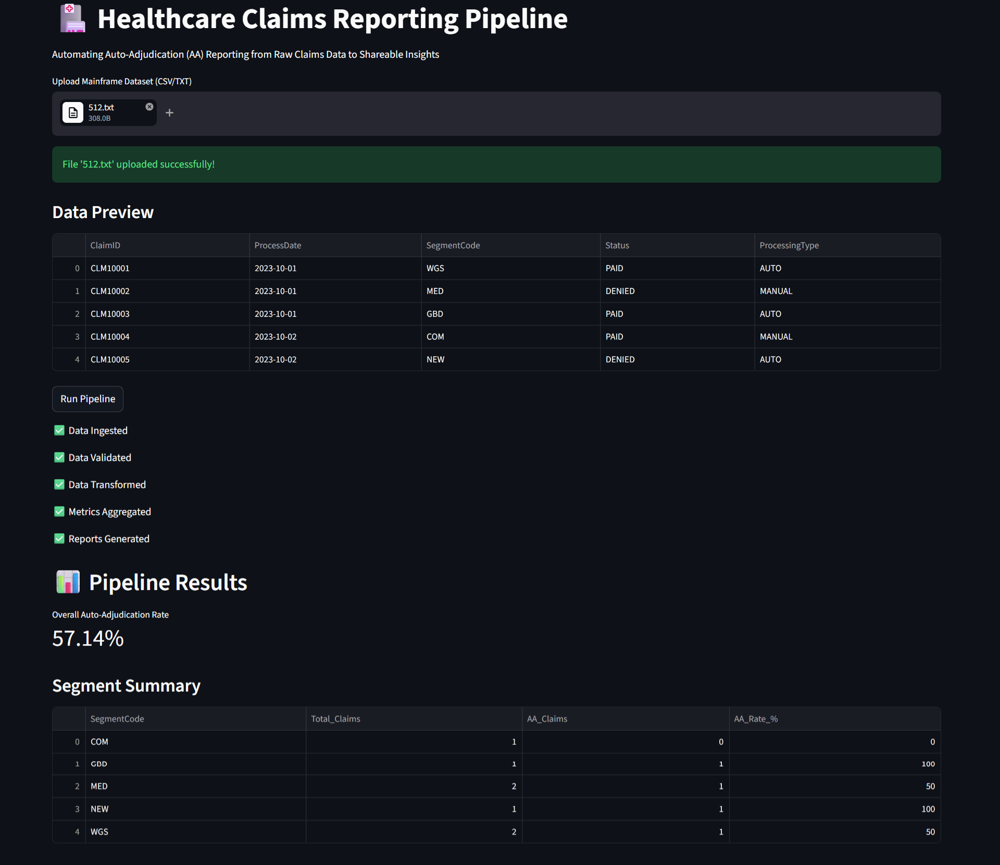
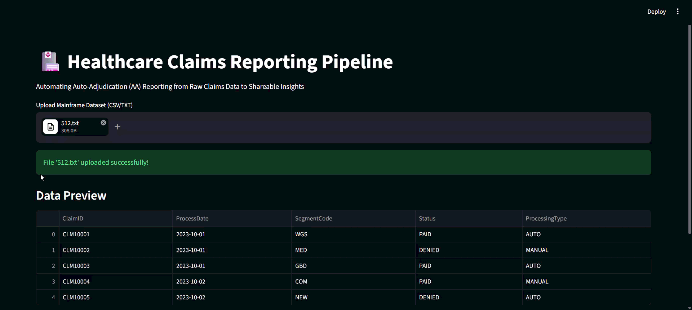

# 🏥 Healthcare Claims Reporting Pipeline

**Problem:** Auto-Adjudication (AA) reporting is manual, slow, and decision-heavy.

This repository showcases a **Streamlit-based UI** that automates claims data processing and turns a fragmented AA reporting workflow into a streamlined, end-to-end pipeline—from raw mainframe data to shareable, email-ready reports.

---

## Problem Statement

The existing AA reporting process is **fragmented and labor-intensive**:

* **Manual data handling** — Teams extract JCL data into Excel
* **Slow processing** — Requires cleanup, validation, and human decision-making
* **Error-prone** — Inconsistent schemas, manual transformations, and duplicate efforts
* **Poor visibility** — Stakeholders wait for Excel reports and email handoffs
* **Siloed storage** — Results scattered across SharePoint, email archives, and local drives

---

## Current Workflow (Before)

```
JCL/Mainframe Extract → Manual Excel Cleanup → Validation → Email → SharePoint Storage
```

❌ **Pain points:** 
- Time-consuming manual steps
- High risk of human error
- Delayed insights and reporting
- No audit trail or consistency

---

## Solution (After)

```
CSV/TXT Upload → Ingest → Validate → Transform → Aggregate → Export → Email Preview
```

✅ **Key improvements:**

* **Centralized Streamlit UI** — Single point for file upload and pipeline execution
* **Automated data pipeline** — Ingest, validate, transform, and aggregate in seconds
* **Intelligent AA transformation** — Business logic to process claims and compute metrics
* **Real-time dashboards** — View overall AA rate, segment breakdowns, and key metrics
* **Email automation** — Generate HTML-ready reports with one click
* **Configuration-driven** — Easy customization via `config.yaml` for recipients, paths, and templates

---

## Impact

| Metric | Improvement |
|--------|-------------|
| **Processing Time** | ⏱️ From hours to seconds |
| **Manual Effort** | 📉 ~80% reduction in Excel work |
| **Data Quality** | ✅ Automated validation eliminates human error |
| **Stakeholder Visibility** | 📊 Real-time metrics and summaries |
| **Consistency** | 🔄 Repeatable, audit-ready pipeline |

---

## Demo

Include screenshots or a GIF here to show the UI flow and output.

* Screenshot: input upload screen

* Screenshot: AA metric summary

* GIF: report preview and email-ready output



---

## Getting Started

### Prerequisites

* Python 3.8+
* pip or conda package manager

### 1. Clone the Repository

```bash
git clone https://github.com/muzammil-13/claims-reporting-ui.git
cd claims-reporting-ui
```

### 2. Create a Virtual Environment (Recommended)

```bash
python -m venv venv

# Activate virtual environment
# On Windows:
venv\Scripts\activate
# On macOS/Linux:
source venv/bin/activate
```

### 3. Install Dependencies

```bash
pip install -r requirements.txt
```

### 4. Configure the Pipeline (Optional)

Edit `config.yaml` to customize:
- Input and output directories
- Email recipients and sender
- Report subject templates

### 5. Start the Streamlit App

```bash
streamlit run app.py
```

The app will open in your browser at `http://localhost:8501`

---

## Project Structure

```
claims-reporting-ui/
│
├── app.py                    # 🎨 Streamlit UI entry point
├── config.yaml               # ⚙️  Configuration (paths, email, templates)
│
├── pipeline/                 # 🔄 Core data pipeline
│   ├── ingest.py            # Load CSV/TXT from mainframe exports
│   ├── validate.py          # Schema validation and data quality checks
│   ├── transform.py         # AA business logic and claims processing
│   ├── aggregate.py         # Compute metrics (AA rate, LOB summaries)
│   └── export.py            # Generate CSV/Excel reports
│
├── automation/              # 📬 Reporting automation
│   └── email.py             # Generate HTML email content (Outlook/SMTP ready)
│
├── data/
│   ├── input/               # Raw mainframe extracts (CSV/TXT)
│   └── output/              # Generated reports and exports
│
├── requirements.txt         # Python dependencies
└── README.md               # This file
```

### Technologies Used

| Component | Technology |
|-----------|-----------|
| **UI Framework** | Streamlit 1.20+ |
| **Data Processing** | Pandas 1.5+ |
| **Configuration** | PyYAML 6.0 |
| **Excel Support** | OpenPyXL 3.1+ |
| **Formatting** | Tabulate 0.9+ |

---

## How It Works

### User Flow

1. **Upload** — User uploads raw claims data (CSV/TXT from mainframe)
2. **Preview** — Pipeline shows data preview for validation
3. **Execute** — Click "Run Pipeline" to trigger automated workflow
4. **Process** — 
   - ✅ Data Ingested (load into DataFrame)
   - ✅ Data Validated (schema checks, required fields)
   - ✅ Data Transformed (apply AA business logic)
   - ✅ Metrics Aggregated (calculate AA rates, LOB summaries)
   - ✅ Reports Generated (export to CSV/Excel)
5. **Review** — See AA rate, segment summaries, and key metrics
6. **Share** — Generate HTML email preview or send directly

### Configuration (config.yaml)

```yaml
paths:
  input_dir: "data/input"      # Where uploads are stored
  output_dir: "data/output"    # Where reports are generated
  
email:
  sender: "pipeline@example.com"
  recipients: ["stakeholders@example.com"]
  subject_template: "Daily Healthcare Claims AA Report - {date}"
```

## Future Enhancements

* 🔗 **SharePoint API integration** — Automated report publishing to SharePoint
* 📈 **Interactive dashboards** — Charts for AA trends over time
* ⏰ **Scheduler support** — Cron / Apache Airflow integration for automated runs
* 🔐 **Backend authentication** — Real database integration for secure data access
* 📄 **PDF export** — Direct PDF generation for archival
* 🧪 **Unit testing** — Comprehensive test coverage for pipeline stages
* 🐳 **Containerization** — Docker support for easy deployment
* 📊 **Advanced analytics** — Drill-down analysis by line of business, claim type, etc.

---

## Learning & Technical Highlights

This project demonstrates:

* **Enterprise workflow automation** — Translating manual processes into scalable pipelines
* **Data engineering in production** — Ingest → validate → transform → aggregate → export
* **Rapid prototyping with Streamlit** — Building functional UIs without frontend overhead
* **Configuration-driven design** — Easy customization without code changes
* **Error handling & validation** — Robust schema validation and graceful failure modes
* **Business logic implementation** — Real-world AA calculation rules and metrics

---

## 🙌 About This Project

* **Built during:** Internship at **IBM Consulting Client Innovation Center**
* **Domain:** Healthcare Claims Processing & Auto-Adjudication (AA) Reporting
* **Inspired by:** Real-world challenges in enterprise claims processing workflows
* **Status:** 🚀 Active and ready for customization

---

## 🚀 Quick Reference

| Task | Command |
|------|---------|
| Install dependencies | `pip install -r requirements.txt` |
| Run the app | `streamlit run app.py` |
| View config options | `cat config.yaml` |
| Access UI | `http://localhost:8501` |

## 📬 Questions or Collaboration?

If you're working on similar automation, data pipeline, or healthcare integration projects, feel free to reach out!

---

⭐ **If you found this useful, consider giving it a star!**

Made with ❤️ for healthcare data automation.
